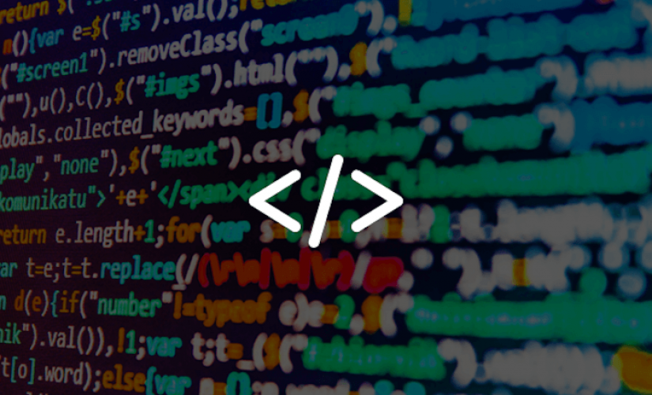

# Web IDE
We developed Web integrated development environment using HTML,CSS & JavaScript
because of we want to make it available on every platform and OS -> 
Windows, macOS, GNU/Linux, Android,IOS.

# How to use the IDE
The integrated development environment contains 2 main parts: 
Text field  for the source code and letters of the English alphabet. 
When mousepointer is on each letter the sound for every letter is playing. 
When the user click on any letter the JavaScript intelisence autocomplete menu 
is shown, then when the mousepointer is on the menu the user can hear the 
keywords and when the keyword is clicked on the text area value is the 
programming statement.
Firstly there are Cut,Copy,Paste and Delete buttons.
Next is the field where the user can write the file name.
Under the source code  text field there are buttons
for reading the current value of the field,
for saving  the current value of the field as .free file.
On the next coloum is the field for open file name
and bellow is the button for .free files Viewer
There is the screenshot 
bellow:
[screenshot:](http://gnulinux.000webhostapp.com/screen1.png)
 
 
# Basic Syntax
 
# Keywords Statements

When you want to print something
on the screen use : [cl.show(  )](#) 
When you want to read input value  
from the keyboard, use : [cl.wr(  )](#) 

# Variable names
For identificator you can use letters a-z,A-Z

# Variable types
When you want to use integer type,
use: [int ](#) 
When you want to use double type,
use: [double ](#) 
When you want to use boolean type,
use: [bool ](#) 
When you want to use char type,
use: [char ](#) 

# Control Statements
 When you want to check for any statement it is true or not,
 use : [if(  ){  }](#) 
 If the statement is not true,
 use: [else{  }](#) 

# Loops
When you want to  execute piece of code while statement
is true, use: [while( ){    }](#) 
 When you want to  execute piece of code while statement
is true, use: [ do {  }](#) 
When you want to mix do loop and
while loop use: [do {  } while(  );](#) 
When you want to repeat a piece of code
n-times use: [for(int i=0;i<=10;i++)](#) 
# Arrays
When you want to store many one type vabiables,
you will use array (for example: integer array) [int arr1[5]=[1,2,3,4,5]](#) 
 
# Functions
When you want to use a piece of code
n-times use: [func indent(){ }](#) 
[Freedom Main File Directory]() 
[Open IDE from here:]() 
The compiler is not ready yet, but
 [You can findout The Lexer 
here:]() 
 
Go back to [Home page](README.md) 
