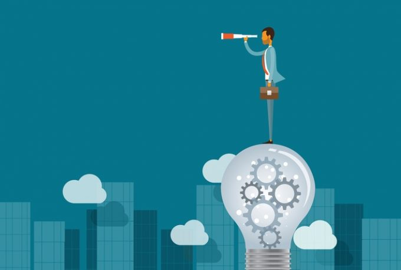

# OverView
Our target is to create a programming language for blind people and allow them 
to live and work as well as everyone else. Because of we called it Freedom,
because we want to give Freedom to blind people and we want to tell them: 
-"Don't stay, just live!"
Freedom programming language has a easy syntax to learn and it has sencitive 
IDE whitch make programming on Freedom programming language easier.
 
Go back to [Home page](README.md) 
