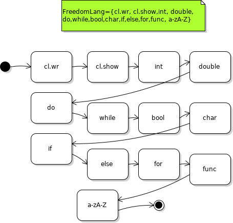

# Mathematical Basis of Freedom Language ( Discrete math)
## Automatic Grammar
FreedomLang={cl.wr, cl.show,int, double, 
do,while,bool,char,if,else,for,func, a-zA-Z}

[S -> cl.wr A]()
[A -> cl.show B]()
[B -> int C]()
[C -> double D]()
[D -> do E]()
[E -> while F]()
[F -> bool T]()
[T -> char R]()
[R -> if Y]()
[Y -> else L]()
[L -> for K]()
[K -> func U]()
[U -> a-zA-Z]()
## Undetermined finite state machine

Go back to [Home page](README.md) 
